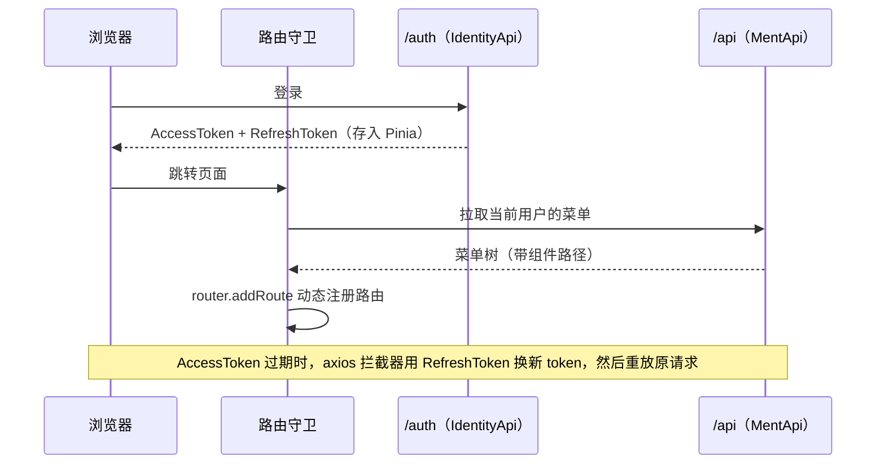
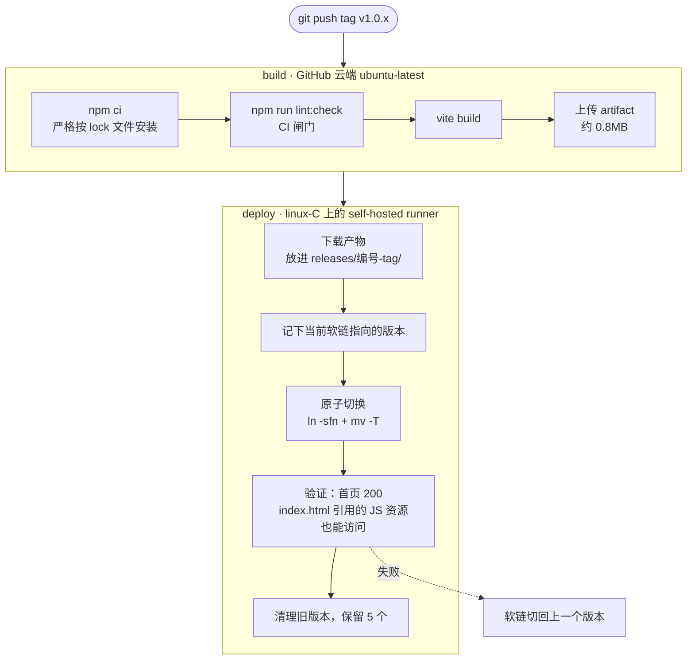

# Zhaoxi.Web · 后台管理系统前端

用 **Vue 3 + Vite + Element Plus** 写的后台管理前端。菜单和路由根据登录用户的权限，由后端动态下发。
这个仓库的重点是**前端发布流程**：打 tag 发布，服务器上用软链做原子切换，发布后自动验证，失败时自动回滚，并保留最近 5 个版本可以随时切回。

[](https://github.com/liangfeng-hash/Zhaoxi.Web/actions/workflows/deploy-linux.yml)

- 线上地址：<https://fengyuan.online>
- 发布记录：[Actions](https://github.com/liangfeng-hash/Zhaoxi.Web/actions)
- 配套仓库：[Zhaoxi.Management](https://github.com/liangfeng-hash/Zhaoxi.Management)（.NET 8 后端）· [Zhaoxi.Gateway](https://github.com/liangfeng-hash/Zhaoxi.Gateway)（YARP 网关）

## 技术栈

| 分类 | 选型 |
| --- | --- |
| 框架 | Vue 3（`<script setup>`）、Vite、Vue Router（hash 模式） |
| UI | Element Plus（按需自动引入）、ECharts、高德地图 JS API |
| 状态 | Pinia + 持久化插件 |
| 请求 | axios 统一封装：自动带 token，AccessToken 过期后用 RefreshToken 无感刷新 |
| 质量 | ESLint 9（flat config）+ Prettier，lint 不通过时 CI 直接中止 |

## 权限与路由



所有 API 地址都用相对路径（`/api`、`/auth`），环境之间的差异交给 Nginx 或 YARP 处理。所以**同一份 `dist` 可以部署到任何环境**：开发时由 Vite proxy 转发，生产上由 Nginx 反向代理。

## 发布流水线



### 服务器目录结构

```
/var/www/
├── releases/
│   ├── 8-v1.0.3/
│   ├── 9-v1.0.4/
│   └── 10-v1.0.5/      ← 当前版本
└── vue -> releases/10-v1.0.5    # Nginx root 指向这个软链
```

### 设计取舍

| 问题 | 做法 | 原因 |
| --- | --- | --- |
| 前端要不要进容器 | **不进容器**，由宿主机 Nginx 直接托管静态文件 | 宿主机 Nginx 已经配好了 HTTPS、缓存和反向代理，放进容器只会多套一层 Nginx |
| 怎么做到零停机切换 | 先建新软链，再 `mv -T` 覆盖旧软链 | `ln -sfn` 是先删后建，中间有一瞬间软链不存在；`mv -T` 底层是 `rename(2)`，属于原子操作 |
| 怎么回滚 | 旧版本目录都还在，把软链指回去即可 | 秒级完成，不用重新构建 |
| 在哪里构建 | GitHub 云端 runner | 服务器从 GitHub 下载很慢（~20KB/s），但前端产物只有 0.8MB，可以接受；后端镜像大，所以改走镜像仓库 |

### 实际踩过的坑

- **清理旧版本时差点删掉新版本**：`cp -a` 会把源目录的 mtime 一起带过去，导致 `ls -t` 排序错乱。现在落地后先 `touch`，清理时按 run_number 排序。
- **`ln: Permission denied`**：替换软链改的是**父目录**的目录项，所以要看父目录的写权限，而不是软链本身的权限。
- **`npm install` 能跑，`npm ci` 却失败**：`npm ci` 严格按 lock 文件安装，peer 依赖冲突时会直接退出。上 CI 之前，先在本地把 CI 的三步完整跑一遍。

## 多环境

| 环境 | 部署方式 | 流水线 |
| --- | --- | --- |
| 生产 linux-C | Nginx 托管 + 软链切换 | `deploy-linux.yml`（tag 触发） |
| 本机 Windows | 同步到 YARP 网关的 `wwwroot`，由网关统一托管前端和 API | `deploy-local.yml` |

## 本地开发

```bash
npm install
npm run dev    # .env.development 默认把请求代理到 localhost:8000（API）和 localhost:8001（认证）
```
